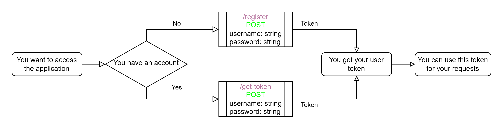

# MUSIC! SERVER Documentation

- [MUSIC! SERVER Documentation](#music-server-documentation)
- [Authentication pipeline](#authentication-pipeline)
- [Endpoints](#endpoints)

 

# Authentication pipeline

The authentication is assured using a unique generated token per account.

Here is a quick diagram who ilustrate how to get your user token:   

 

# Endpoints

- [Database specifics endpoints](database_specific.md)
- [Users endpoints](users.md)

